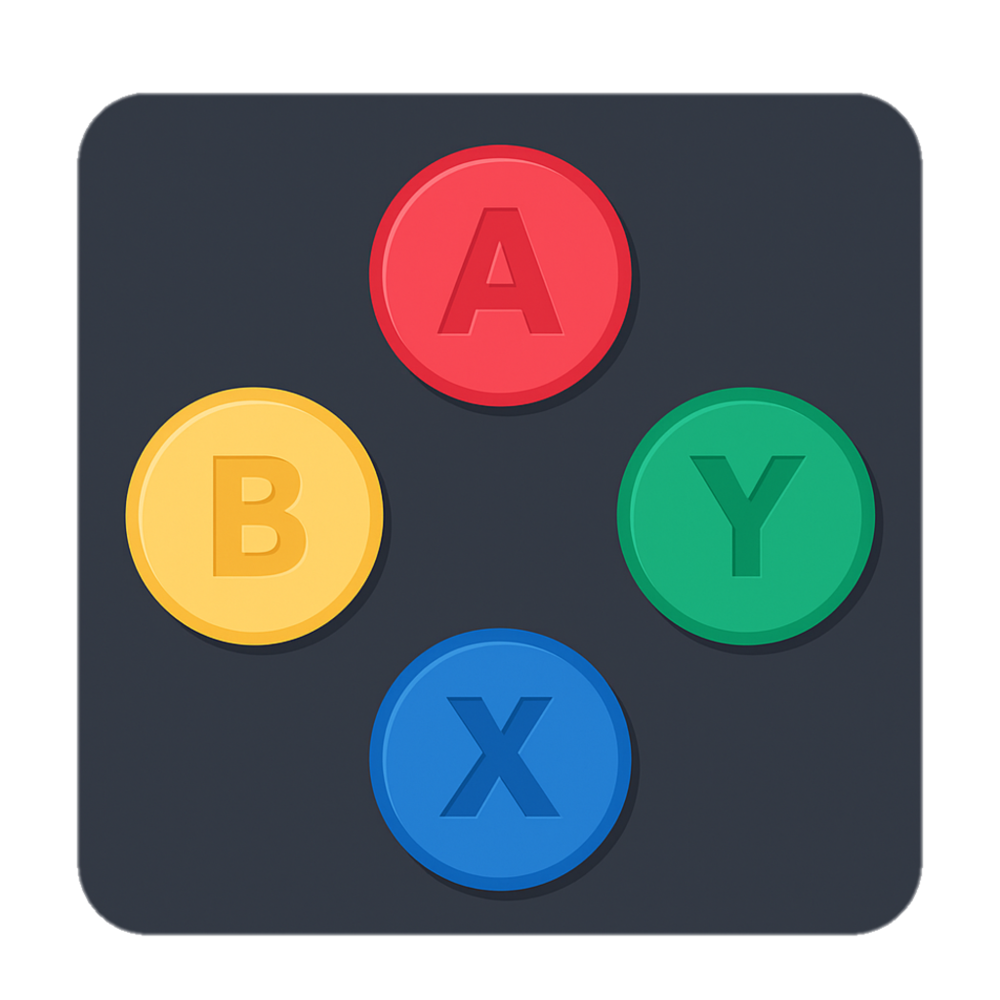

# 🕹️ Idle Game

Projeto de um jogo do tipo **Idle** (incremental), desenvolvido com tecnologias modernas de frontend e backend.

## 🚀 Tecnologias Utilizadas

- **Next.js** (com App Router)
- **Tailwind CSS** (estilização)
- **Flowbite** (componentes de UI)
- **MongoDB** (banco de dados)
- **Zustand** (gerenciamento de estado)

## 📜 Sobre

Este projeto é um jogo onde os jogadores acumulam recursos passivamente, desbloqueiam melhorias e evoluem seu progresso continuamente.  
O objetivo é criar uma experiência simples, divertida e expansível.
